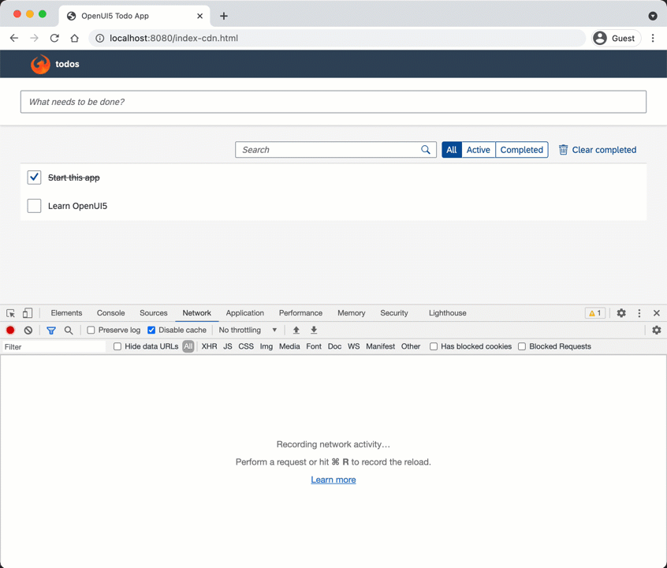

# ui5-service-worker-sample
[](https://api.reuse.software/info/github.com/SAP-samples/ui5-service-worker-sample)

## Description

This sample demonstrates how the [Service Worker API](https://developer.mozilla.org/en-US/docs/Web/API/Service_Worker_API), available in modern web browsers, could be used in a UI5 app to realize different caching strategies.

It includes the [openui5-sample-app](https://github.com/SAP/openui5-sample-app) and combines it with the ui5-service-worker code itself.

*DISCLAIMER*: This sample demonstrates possible usages of service workers for caching strategies of an UI5 app. You have to figure out what parts to adopt for your own productive applications.

## Requirements

- [Node.js](https://nodejs.org/) Version 14 or later

## Download and Installation

1. Clone this repository and navigate into it
    ```sh
    git clone https://github.com/SAP-samples/ui5-service-worker-sample.git
    cd ui5-service-worker-sample
    ```
1. Install all dependencies
    ```sh
    npm install
    ```

1. Build the application
    ```sh
    npm run build-ui5
    ```

1. Start a local server and run the application
    ```sh
    npm start
    ```

1. Navigate to
    http://localhost:8080/index.html

## Video



## Content Structure

This ui5-service-worker-sample project consists of:
1. openui5-sample-app
    * Version: 0.3.0
    * Commit: f71d13de9ba827d1429b568296a89b92cabb8315
    * via public repository https://github.com/SAP/openui5-sample-app
1. ui5-service-worker
    * Version: 1.0.0
    * via local folder [ui5-service-worker/](https://github.com/SAP-samples/ui5-service-worker-sample/tree/main/ui5-service-worker)

## Integrate into Own App
Follow the detailed [Integration](./docs/integration.md) section on how you could extract and integrate the ui5-service-worker into your own application.

## Configuration
Find additional configuration options of the ui5-service-worker in the
[Configuration](./ui5-service-worker/README.md#configuration) section.

## UI5con Presentation

This sample project was derived to showcase features originally presented at [UI5con](https://openui5.org/ui5con/germany2019/material2019.html):
* [Presentation Slides](https://tobiasso85.github.io/ui5con2019-service-worker-slides)
* [Video Recording](https://youtu.be/z_bwa1wMyT4)


## Alternative Scenarios

* Serve the sample application with a local server using h2
    ```sh
    npm run start-h2
    ```

## Known Issues
No major bugs known.

## Contributing
In general the contributing guidelines of OpenUI5 also apply to this project. They can be found here:
https://github.com/SAP/openui5/blob/master/CONTRIBUTING.md

Some parts might not be relevant for this project (e.g. the browser-specific requirements like jQuery, CSS and accessibility in the "Contribution Content Guidelines") and the contribution process is easier (pull requests will be merged directly on GitHub).

## Contributing with AI-generated code
As artificial intelligence evolves, AI-generated code is becoming valuable for many software projects, including open-source initiatives. While we recognize the potential benefits of incorporating AI-generated content into our open-source projects there are certain requirements that need to be reflected and adhered to when making contributions.

Please see our [guideline for AI-generated code contributions to SAP Open Source Software Projects](https://github.com/SAP/.github/blob/main/CONTRIBUTING_USING_GENAI.md) for these requirements.

## License
Copyright (c) 2021 SAP SE or an SAP affiliate company. All rights reserved. This project is licensed under the Apache Software License, version 2.0 except as noted otherwise in the [LICENSE](LICENSES/Apache-2.0.txt) file.
